# Setting Up and Testing Terraform Locally

- [Setting Up SSO Profile to Interactively Practice Terraform](https://github.com/jvuzzell/setup-terraform-locally/edit/main/readme.md#step-1---setting-up-sso-profile-to-interactively-practice-terraform)
- [Step 2 - Alternative Means for Granting Terraform Access to AWS within a  Bitbucket Pipeline](https://github.com/jvuzzell/setup-terraform-locally?tab=readme-ov-file#step-2---alternative-means-for-granting-terraform-access-to-aws-within-a--bitbucket-pipeline)
- [Step 3 - Install AWS Cli](https://github.com/jvuzzell/setup-terraform-locally?tab=readme-ov-file#step-3---install-aws-cli)
- [Step 4 - Adding AWS Credentials for Terraform to Your Environment](https://github.com/jvuzzell/setup-terraform-locally?tab=readme-ov-file#step-4---adding-aws-credentials-for-terraform-to-your-environment)
- [Step 5 - Install Terraform Locally](https://github.com/jvuzzell/setup-terraform-locally?tab=readme-ov-file#step-5---install-terraform-locally)
- [Step 6 - Test Terraform with AWS](https://github.com/jvuzzell/setup-terraform-locally?tab=readme-ov-file#step-6---test-terraform-with-aws)

## Step 1 - Setting Up SSO Profile to Interactively Practice Terraform

Note: The following method for interactive configuration is best suited for securely practicing and testing Terraform. This will not work directly in the Bitbucket Pipeline because of the login process pictured below.

1. IAM Identity Center → Add Group
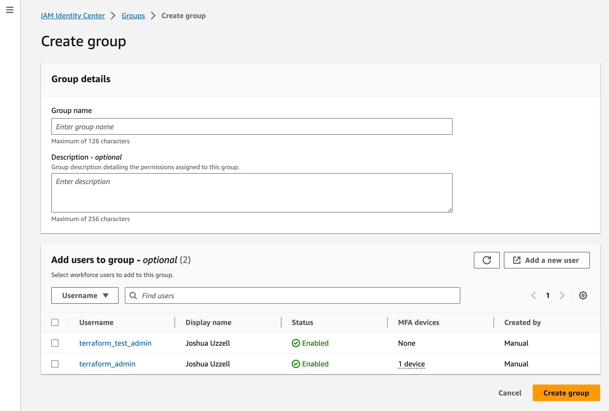

2. Assign Permissions to Group → Select Account
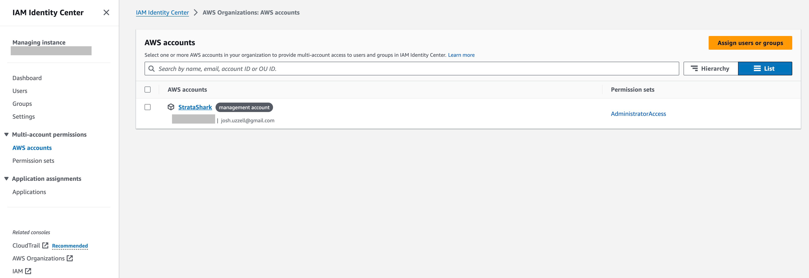

3. Assign group to AWS account
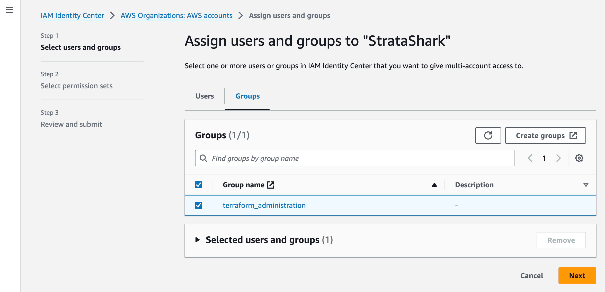

4. Create permissions set
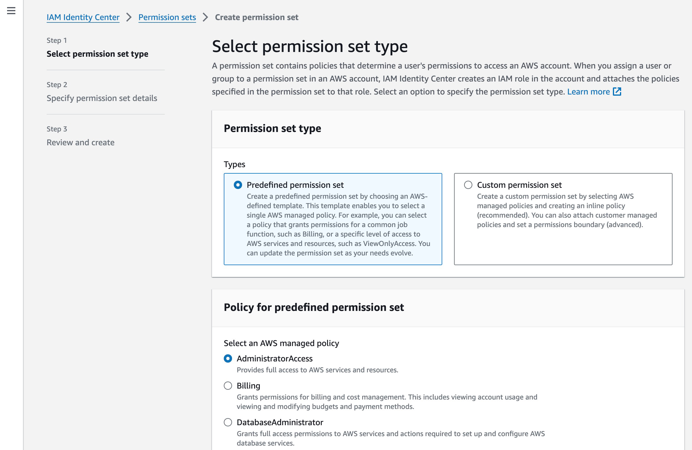

5. Select permissions set and confirm the assignment of permissions to the group
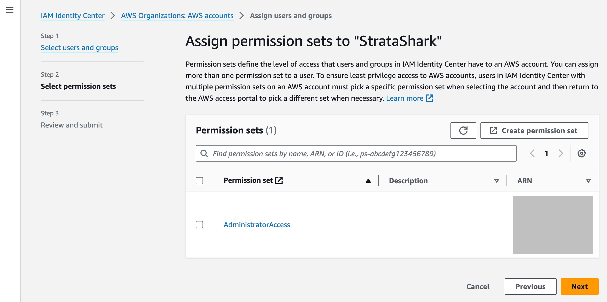

6. IAM Identity Center → Add User
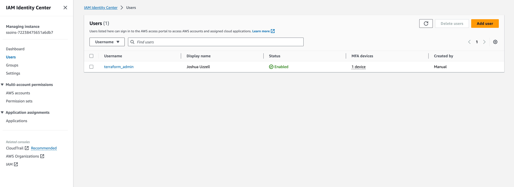

7. Specify user details
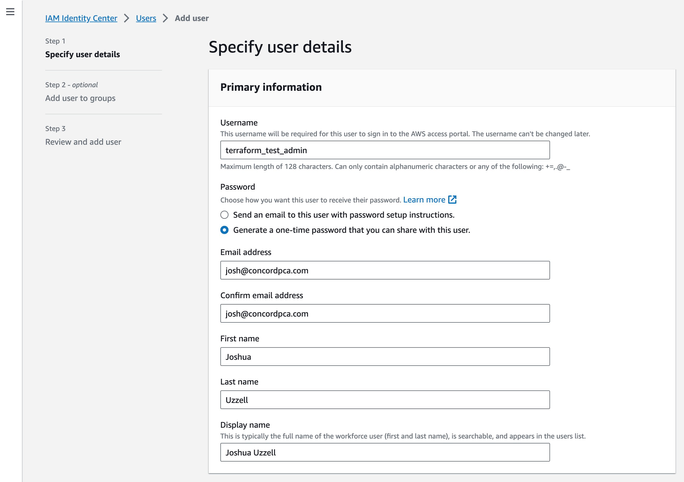

8. Add user to group; the group should have permissions corresponding to the resources Terraform will manage.
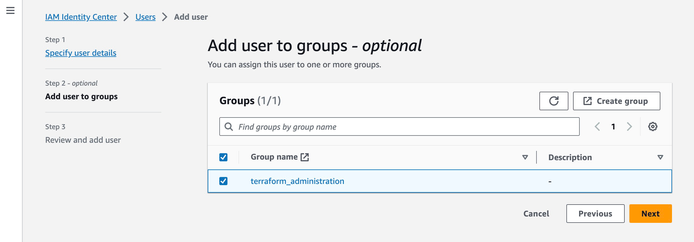

9. Confirm user
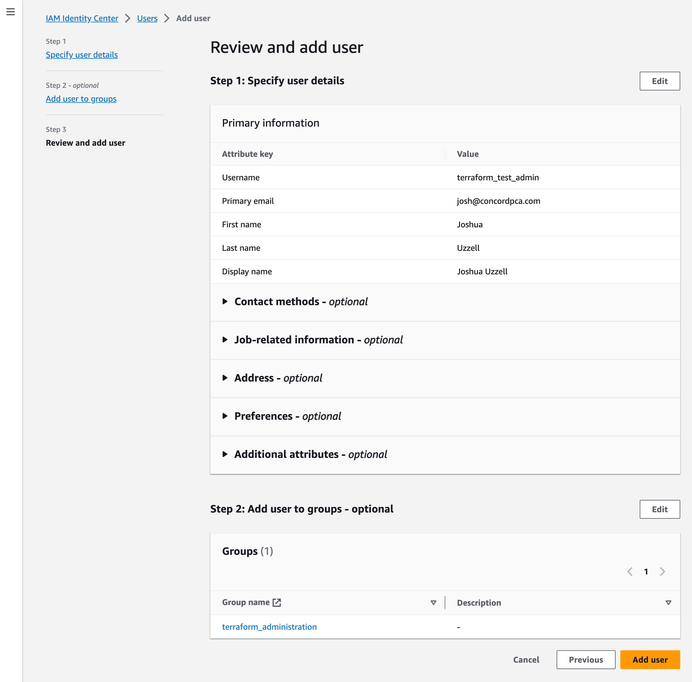
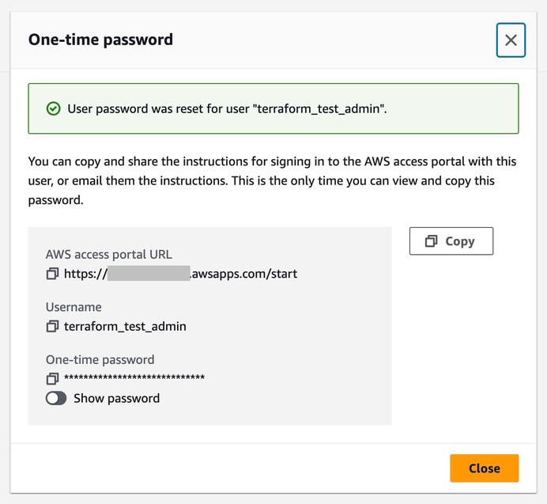

10. Login and verify your account; this may require using MFA. At this point, you’re ready for the next section!

## Step 2 - Alternative Means for Granting Terraform Access to AWS within a  Bitbucket Pipeline

Using an AWS CLI profile, especially one configured for AWS Single Sign-On (SSO), in a Bitbucket Pipeline can indeed be challenging. Bitbucket Pipelines, like other CI/CD systems, are better suited to using static credentials or roles for AWS access due to their non-interactive nature. AWS SSO is designed primarily for interactive use cases where a user can log in through a browser.

However, there are ways to work around this and securely manage AWS credentials in Bitbucket Pipelines:

### 1. Use Static Credentials (Not Recommended for Production)

You can use static AWS Access Key ID and Secret Access Key in your pipeline. This method is straightforward but not recommended for production environments due to security reasons.

- Store the credentials as secured environment variables in Bitbucket.

- Use these variables in your pipeline to configure AWS CLI or pass them to Terraform.

### 2. Use IAM Roles with AssumeRole

A more secure method is to use an IAM role with AssumeRole. This approach involves creating an IAM role that your pipeline can assume to get temporary credentials.

- Create an IAM role with the necessary permissions and trust relationship to allow Bitbucket Pipelines to assume this role.

- In Bitbucket, store the access key, secret key, and role ARN as secured variables.

- Modify your pipeline script to assume the IAM role and use the resulting temporary credentials.

### 3. Use OpenID Connect (OIDC) with Bitbucket Pipelines

If supported by your AWS setup, you can use OIDC federation between AWS and Bitbucket. This allows Bitbucket Pipelines to assume an IAM role without the need for static credentials.

- Set up an OIDC identity provider in AWS for Bitbucket.

- Create an IAM role that trusts the OIDC identity provider.

- Configure your Bitbucket Pipeline to assume this role.

### 4. Terraform Cloud as an Alternative

If you're using Terraform, consider using Terraform Cloud for running Terraform operations. Terraform Cloud can securely store your AWS credentials and manage state files, making it a good fit for CI/CD pipelines.

- Security Considerations

- Principle of Least Privilege: Ensure that the IAM roles or users have only the permissions necessary to perform the required tasks.

- Audit and Monitor: Regularly audit your AWS and Bitbucket configurations and monitor for any unauthorized access.

## Step 1 - Install AWS CLI

### Bash (MacOS w/ Homebrew)

    $ brew install awscli
    $ aws --version

### Bash (WSL)
    $ curl "https://awscli.amazonaws.com/awscli-exe-linux-x86_64.zip" -o "awscliv2.zip"
    $ unzip awscliv2.zip
    $ sudo ./aws/install

## Step 3 - Adding AWS Credentials for Terraform to Your Environment

- You need to have an AWS account with the necessary permissions to create and manage resources.

- Install the AWS CLI tool and configure it with your AWS credentials (Access Key ID and Secret Access Key). You can do this by running aws configure in your terminal. 

    - To configure AWS CLI to use SSO: 

        - `$ aws configure sso`
        - Also see the Bash Script - AWS CLI SSO Wizard 

- Alternatively, you can statically set your credentials as environment variables. For example:

        export AWS_ACCESS_KEY_ID="your_access_key"
        export AWS_SECRET_ACCESS_KEY="your_secret_key"
        export AWS_DEFAULT_REGION="your_preferred_region"

    Note: This method is better suited for non-interactive configuration management but it has known security risks

### AWS Account Permissions for Terraform 

To effectively run Terraform, especially for provisioning and managing resources in a cloud environment like AWS, your account needs to have permissions that correspond to the resources Terraform will manage.

### General Permissions: 

- Creating, updating, and deleting resources.
- Managing networking settings if your Terraform scripts configure network resources.
- Accessing any required APIs or services that your Terraform configuration interacts with. 

### Relevant AWS Policies

1. AdministratorAccess: The simplest approach is to have an AWS account with AdministratorAccess. This is a broad permission that allows Terraform to manage all resources in your AWS account. However, this level of access might not be suitable for production environments due to security concerns.

2. Custom IAM Policies: A more secure approach is to create custom IAM (Identity and Access Management) policies that grant only the necessary permissions. For example, if your Terraform scripts are used to manage EC2 instances and S3 buckets, your IAM user should have policies that allow actions like ec2:* and s3:*.

3. Least Privilege Principle: It's a best practice to follow the principle of least privilege, giving your account only the permissions necessary to perform its tasks. This minimizes security risks.

4. Terraform State File Storage: If you are using S3 for storing Terraform state files, ensure permissions for actions like `s3:PutObject, s3:GetObject, and s3:DeleteObject` on the specific S3 bucket.

### Bash Script - AWS CLI SSO Wizard

    !/bin/bash

    # Script to configure AWS CLI with AWS SSO

    echo "Starting AWS CLI SSO configuration..."

    # Check if AWS CLI v2 is installed
    if ! aws --version | grep "aws-cli/2" &> /dev/null; then
        echo "AWS CLI version 2 is required for SSO. Please install it first."
        exit 1
    fi

    # Prompt for SSO details
    read -p "Enter your AWS SSO URL (e.g., https://my-sso-portal.awsapps.com/start): " sso_url
    read -p "Enter your AWS SSO Region (e.g., us-west-2): " sso_region
    read -p "Enter your AWS SSO Account ID (e.g., 123456789012): " sso_account_id
    read -p "Enter your AWS SSO Role Name (e.g., MySSORole): " sso_role_name

    # Start AWS CLI SSO configuration
    aws configure sso --sso-start-url $sso_url --sso-region $sso_region

    echo "Follow the instructions in the browser to log in to your AWS SSO account."

    # Prompt for profile name
    read -p "Enter a name for this AWS CLI SSO profile: " profile_name

    # Set the profile name
    aws configure set profile.$profile_name.sso_start_url $sso_url
    aws configure set profile.$profile_name.sso_region $sso_region
    aws configure set profile.$profile_name.sso_account_id $sso_account_id
    aws configure set profile.$profile_name.sso_role_name $sso_role_name

    echo "AWS CLI is configured with SSO. Use the profile by specifying --profile $profile_name in your AWS CLI commands."

    # Test the configuration
    echo "Testing the configuration by listing available AWS regions..."
    if aws ec2 describe-regions --profile $profile_name --output text; then
        echo "Configuration test successful."
    else
        echo "Configuration test failed. Please check your setup."
    fi

## Step 4 - Install Terraform Locally

### Bash Script (MacOS w/ Homebrew)

    !/bin/bash

    # Check for Homebrew, install if we don't have it
    if test ! $(which brew); then
        echo "Installing Homebrew..."
        /bin/bash -c "$(curl -fsSL https://raw.githubusercontent.com/Homebrew/install/HEAD/install.sh)"
    fi

    # Update Homebrew
    echo "Updating Homebrew..."
    brew update

    # Install Terraform
    echo "Installing Terraform..."
    brew install terraform

    # Verify the installation
    if terraform -version; then
        echo "Terraform was installed successfully."
    else
        echo "Terraform installation failed."
    fi

### Bash Script (WSL) 

    #!/bin/bash

    # Update package lists
    echo "Updating package lists..."
    sudo apt update

    # Install required tools if not already installed (curl, unzip)
    echo "Installing necessary tools..."
    sudo apt install -y curl unzip

    # Check if Terraform is installed
    if ! command -v terraform &> /dev/null; then
        echo "Downloading Terraform..."
        curl -fsSL https://releases.hashicorp.com/terraform/1.0.0/terraform_1.0.0_linux_amd64.zip -o terraform.zip

        echo "Installing Terraform..."
        unzip terraform.zip
        sudo mv terraform /usr/local/bin/
        rm terraform.zip
    else
        echo "Terraform is already installed."
    fi

    # Verify the installation
    if terraform -version; then
        echo "Terraform was installed successfully."
    else
        echo "Terraform installation failed."
    fi

### Script Use (MacOS & WSL)

1. Copy the script into a file on your MacBook Pro. You can name the file something like install_terraform.sh.

2. Open your terminal and navigate to the directory where the script is saved.

3. Make the script executable with the command chmod +x install_terraform.sh.

4. Run the script with `./install_terraform.sh`.

# Step 5 - Test Terraform with AWS

### Bash Script

    #!/bin/bash

    # Define AWS Region and Bucket Name
    AWS_REGION="us-east-1" # Change this to your preferred region
    BUCKET_NAME="my-terraform-test-bucket-$(date +%s)" # Unique bucket name with timestamp
    PROFILE="terra_test"

    # Check if a cached SSO file exists
    if [ -d "$HOME/.aws/sso/cache" ] && [ -n "$(ls -A $HOME/.aws/sso/cache)" ]; then
        echo "SSO cache found. Checking for valid credentials..."

        # Replace 'aws s3 ls' with a lightweight command that suits your use case
        if aws s3 ls --profile "$PROFILE" &> /dev/null; then
            echo "You are logged in with AWS SSO."
        else
            echo "Your session has expired or credentials are invalid."
            aws sso login --profile "${PROFILE}"
        fi
    else
        echo "No AWS SSO cache found. You are not logged in."
        aws sso login --profile "${PROFILE}"
    fi

    # Create Terraform configuration
    mkdir terraform-test
    cd terraform-test

    cat <<EOF >main.tf
    terraform {
        required_providers {
            aws = {
                source  = "hashicorp/aws"
                version = "~> 3.0"
            }
        }
    }

    provider "aws" {
        region = "${AWS_REGION}"
        profile = "${PROFILE}"
    }

    resource "aws_s3_bucket" "my_bucket" {
        bucket = "${BUCKET_NAME}"
    }
    EOF

    # Initialize and apply Terraform
    terraform init
    terraform apply -auto-approve

    # Check if the bucket was created
    aws s3 ls "s3://${BUCKET_NAME}" --profile "${PROFILE}" &> /dev/null

    if [ $? -eq 0 ]; then
        echo "S3 bucket created successfully."
    else
        echo "Failed to create S3 bucket."
    fi

    # Clean up resources
    echo "Destroying created resources..."
    terraform destroy -auto-approve
    cd ..
    rm -rf terraform-test

### Expected Output
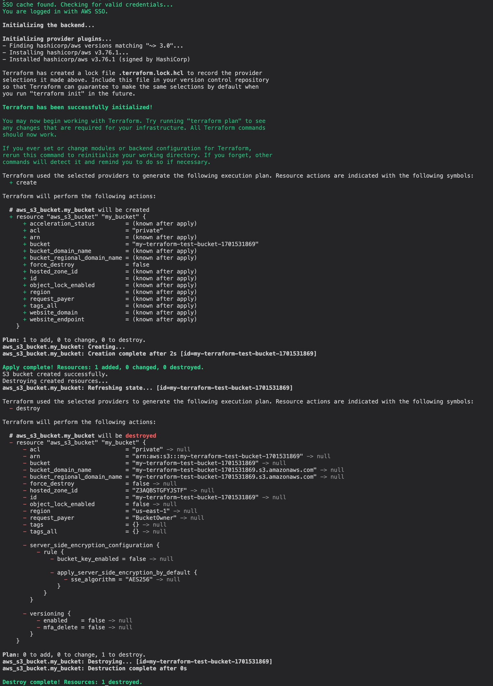

### Script Use

1. Copy the script into a file, for example `test_terraform.sh`.

2. Make sure you have the necessary permissions to execute these commands on your machine.

3. Make the script executable: chmod +x test_terraform.sh.

4. Run the script: `./test_terraform.sh`.

This script will create a new directory for the test, generate a main.tf file with a basic configuration to create an S3 bucket, initialize Terraform, apply the configuration, check if the bucket exists, and finally clean up by destroying the created resources and deleting the test directory.